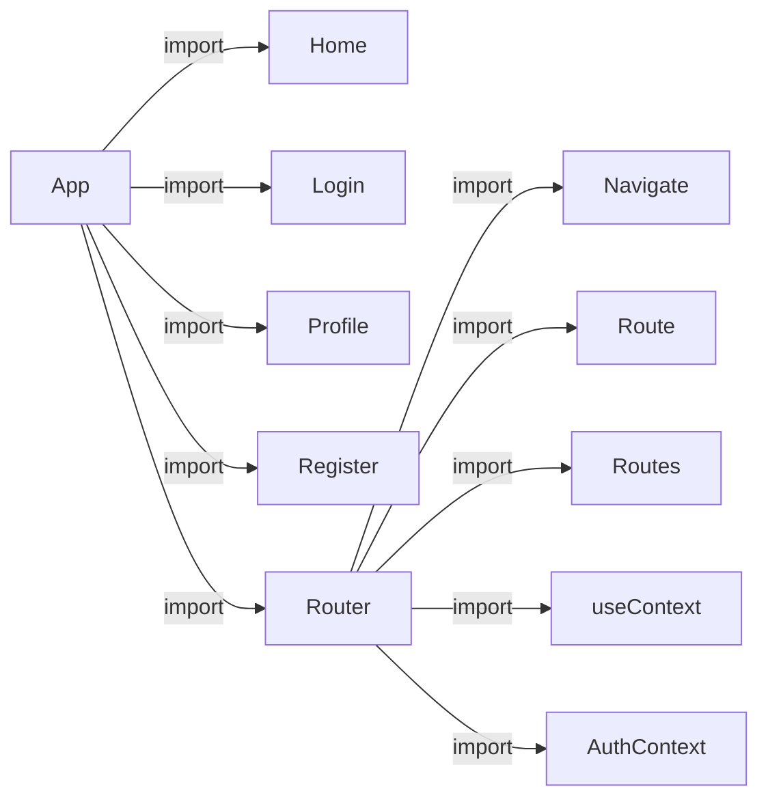

# README

このプログラムはReactアプリケーションであり、認証機能付きのソーシャルメディアアプリケーションとなります。

## ディレクトリ構成

```
└──frontend
    ├──README.md
    ├──package-lock.json
    ├──package.json
    ├──public
    │   ├──assets
    │   │   ├──event.jpeg
    │   │   ├──heart.png
    │   │   ├──person
    │   │   │   ├──1.jpeg
    │   │   │   ├──2.jpeg
    │   │   │   ├──3.jpeg
    │   │   │   ├──4.jpeg
    │   │   │   ├──5.jpeg
    │   │   │   └──noAvatar.png
    │   │   ├──post
    │   │   │   ├──1.jpeg
    │   │   │   ├──2.jpeg
    │   │   │   ├──3.jpeg
    │   │   │   ├──4.jpeg
    │   │   │   └──5.jpeg
    │   │   ├──promotion
    │   │   │   ├──promotion1.jpeg
    │   │   │   ├──promotion2.jpeg
    │   │   │   └──promotion3.jpeg
    │   │   └──star.png
    │   ├──favicon.ico
    │   ├──index.html
    │   ├──manifest.json
    │   └──robots.txt
    └──src
        ├──App.js
        ├──actionCall.js
        ├──components
        │   ├──friend
        │   │   ├──Friend.css
        │   │   └──Friend.jsx
        │   ├──online
        │   │   ├──Online.css
        │   │   └──Online.jsx
        │   ├──post
        │   │   ├──Post.css
        │   │   └──Post.jsx
        │   ├──rightbar
        │   │   ├──Rightbar.css
        │   │   └──Rightbar.jsx
        │   ├──share
        │   │   ├──Share.css
        │   │   └──Share.jsx
        │   ├──sidebar
        │   │   ├──Sidebar.css
        │   │   └──Sidebar.jsx
        │   ├──timeline
        │   │   ├──TimeLine.css
        │   │   └──TimeLine.jsx
        │   └──topbar
        │       ├──Topbar.css
        │       └──Topbar.jsx
        ├──dummyData.js
        ├──imageRequire.js
        ├──index.js
        ├──pages
        │   ├──home
        │   │   ├──Home.css
        │   │   └──Home.jsx
        │   ├──login
        │   │   ├──Login.css
        │   │   └──Login.jsx
        │   ├──profile
        │   │   ├──Profile.css
        │   │   └──Profile.jsx
        │   └──register
        │       ├──Register.css
        │       └──Register.jsx
        ├──state
        │   ├──AuthActions.js
        │   ├──AuthContext.js
        │   └──AuthReducer.js
        └──style.css
```

## 使用方法

1. ターミナルで以下のコマンドを実行します。

```
npm install
```

2. 次に、以下のコマンドを実行します。

```
npm start
```

3. ウェブブラウザで `http://localhost:3000` を開きます。

## ソースコード

```javascript
import Home from "./pages/home/Home";
import Login from "./pages/login/Login";
import Profile from "./pages/profile/Profile";
import Register from "./pages/register/Register";
import { BrowserRouter as Router, Navigate, Route, Routes, } from "react-router-dom";
import './style.css'
import { useContext } from "react";
import { AuthContext } from "./state/AuthContext";

function App() {
  
  const { user } = useContext(AuthContext)

  return (
    // ルーティング
      <Router>
        <Routes>
          {/* userがないなら登録画面へ */}
          <Route path="/" element={user ? <Home/> : <Navigate to="/register"/>} />
          {/* userがある場合Homeコンポーネントへリダイレクト */}
          <Route path="/login" element={user ? <Navigate to = "/" /> : <Login/>}/>
          <Route path="/register" element={user ? <Navigate to = "/" /> : <Register/>}/>
          <Route path="/profile/:username" element={<Profile/>}/>
        </Routes>
      </Router>
  );
}

export default App;
```

## ライセンス

MIT License

## MERMAIDによる構成図

